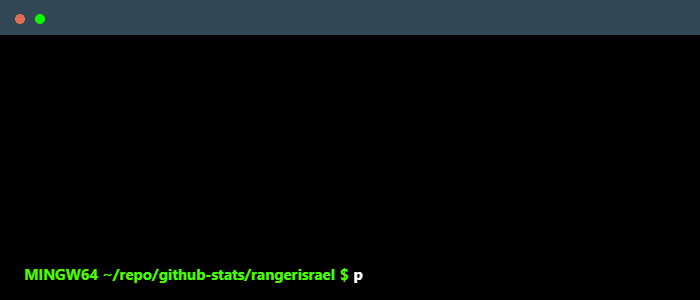

  

# 💫 About Me:

## 👋 Hello! I hope you're doing well — allow me to introduce myself.

A passionate and proactive problem solver with a strong enthusiasm for technology, driven by continuous learning and a growth mindset. Eager to take on challenges and contribute innovative solutions in a dynamic team environment.

## 💡 What Drives Me

I’m driven by a deep curiosity for technology and a growth mindset. I enjoy turning challenges into opportunities to improve and innovate, whether it’s crafting beautiful UIs or architecting robust backend APIs.

## 🚀 Projects & Focus

- Building full-stack applications with seamless user experiences
- Writing reliable and maintainable code with tests
- Exploring performance optimization, design patterns, and modern development tools

## 📫 Let's Connect

<!-- - 🌐 [My Portfolio](https://yourwebsite.com) -->
<!-- https://www.terminalgif.com/ -->

- 💼 [LinkedIn](https://www.linkedin.com/in/israel-alisoso-b007521b2)

## 🌐 Socials:

# 💻 🛠️ Tech Stack & Tools

    

                                                         

## 🏆 GitHub Trophies

# 📊 GitHub Stats:

<!--  
 
 -->

<table>
  <tr>
    <td>
      
    </td>
    <td>
      
    </td>
  </tr>
</table>

  

### ✍️ Random Dev Quote

  

---

<!-- Proudly created with GPRM ( https://gprm.itsvg.in ) -->
